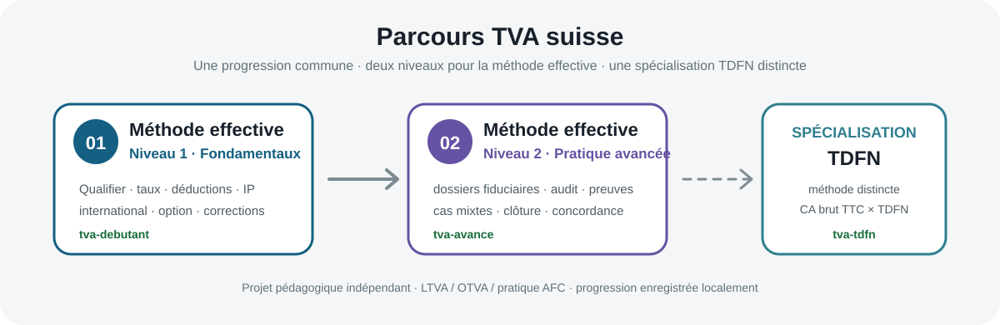

# 🇨🇭 TVA suisse — méthode effective · Niveau 2

### Pratique avancée du décompte TVA suisse pour dossiers PME et fiduciaires

Un parcours interactif, gratuit et en français pour **qualifier, déclarer, contrôler et documenter des situations TVA complexes selon la méthode effective**.

### 👉 [Ouvrir la pratique avancée](https://mariialobur.github.io/tva-avance/)

  

> [!IMPORTANT]
> Ce projet est un **outil pédagogique indépendant**. Il n’est ni un service de l’Administration fédérale des contributions (AFC/ESTV), ni une formation accréditée, ni un conseil fiscal individualisé. La législation, la pratique AFC publiée comme applicable et le service officiel en vigueur restent déterminants.

---

## Pourquoi ce niveau avancé ?

Savoir remplir un décompte simple ne suffit pas pour traiter un dossier réel en fiduciaire. Les difficultés apparaissent lorsque plusieurs mécanismes se croisent: prestations à l’étranger, impôt sur les acquisitions, immobilier, activité exclue, option, subvention, correction de l’impôt préalable, groupe TVA, changement de méthode ou concordance annuelle.

Ce niveau travaille donc moins la mémorisation des rubriques que le **raisonnement professionnel**: qualifier le flux, identifier le traitement TVA, construire le décompte, contrôler la cohérence, puis déterminer quelles pièces permettraient de défendre le dossier lors d’une revue interne ou d’un contrôle.

Le parcours constitue le **Niveau 2 de la méthode effective**. Il complète le niveau fondamental [`tva-debutant`](https://mariialobur.github.io/tva-debutant/) et reste distinct de la spécialisation [`TDFN`](https://mariialobur.github.io/tva-tdfn/), dont la logique de calcul est différente.

---

## En un coup d’œil

| Parcours | Contenu |
|---|---|
| **9 dossiers avancés** | international, immobilier, financements publics, groupe TVA, activités mixtes, changements de méthode, intégrateur et clôture |
| **3 modes** | Apprentissage · Entraînement · Évaluation |
| **Méthode de travail** | qualifier → reporter → contrôler → documenter |
| **Décompte** | rubriques actuelles de la méthode effective, de 200 à 910 selon les dossiers |
| **Contrôle métier** | risques, pièces justificatives, affectation, rapprochements et cohérence |
| **Évaluation finale** | 15 questions tirées aléatoirement, réussite dès 12/15 |
| **Attestation** | 2 pages, générées localement après validation du parcours |
| **Confidentialité** | progression et nom conservés dans le navigateur |

---

## 🧭 Les 9 dossiers actuels

| Cas | Dossier | Compétence principale |
|---|---|---|
| **A** | SaaS étranger | impôt sur les acquisitions, ch. 383 et droit à déduction |
| **B** | Immobilier à usages mixtes | option, ch. 205/230 et correction IP selon l’affectation |
| **C** | Subvention + sponsoring | contre-prestation, art. 18 LTVA, ch. 900 et réduction ch. 420 |
| **D** | Groupe TVA | périmètre du groupe et traitement des flux internes |
| **E** | TDFN → effective | valeur résiduelle et dégrèvement ch. 410 |
| **F** | Effective → TDFN | valeur résiduelle et correction ch. 415 |
| **G** | Activités mixtes | santé, prestation à l’étranger, taux multiples et double affectation |
| **H** | Intégrateur | décompte complexe réunissant plusieurs mécanismes |
| **I** | Concordance annuelle | rapprochement, rectification et dossier de clôture |

Chaque dossier repose sur des **hypothèses factuelles explicites**. Un résultat correct dans un cas ne doit pas être transformé en règle générale lorsque le traitement dépend du lieu de la prestation, du statut du fournisseur, de l’affectation, des preuves disponibles ou des conditions légales d’une option ou d’une exclusion.

---

## ✨ Ce que le parcours permet de travailler

### `1` Qualifier avant de calculer

Le premier réflexe consiste à déterminer la nature TVA de chaque flux avant d’ouvrir le formulaire: prestation imposable, exclue, exonérée, fournie à l’étranger, acquisition soumise à l’impôt sur les acquisitions ou mouvement de fonds hors contre-prestation.

### `2` Construire un décompte cohérent

Les dossiers obligent à relier les rubriques et les totaux: `200 → 289 → 299`, bases `303 / 313 / 343`, impôt sur les acquisitions `383`, impôt préalable `400 / 405 / 410 / 415 / 420`, puis `399 / 479 / 500 / 510`.

### `3` Travailler l’impôt préalable comme en fiduciaire

L’objectif n’est pas d’appliquer automatiquement un pourcentage. Les scénarios distinguent attribution directe, double affectation, correction, réduction et dégrèvement ultérieur. Les clés utilisées sont présentées comme des données documentées du dossier, pas comme des règles universelles.

### `4` Préparer un dossier défendable

Chaque cas peut afficher les contrôles métier et les pièces à conserver: contrats, factures, décisions de subvention, preuves du lieu de prestation, baux, tableaux d’affectation, valeurs résiduelles, grand livre et rapprochements.

### `5` Passer du cas isolé au contrôle de clôture

Les derniers dossiers combinent plusieurs mécanismes et introduisent la logique de rectification et de concordance annuelle afin de rapprocher les décomptes avec la comptabilité.

---

## 🧠 Trois modes de travail

**Apprentissage** affiche les explications, les sources, les contrôles métier et les pièces à conserver. **Entraînement** réduit progressivement l’aide. **Évaluation** masque les indices et le corrigé avant la remise.

Un dossier n’est considéré comme maîtrisé qu’après un résultat de **100 % en mode Évaluation**. Cette exigence sert à distinguer une solution obtenue avec aide d’une résolution autonome.

La progression est enregistrée localement dans le navigateur.

---

## 📈 Évaluation finale

Après validation des **9/9 dossiers** en mode Évaluation, une épreuve séparée devient disponible:

* **15 questions** tirées aléatoirement d’une banque plus large;
* réponses mélangées;
* aucune aide ou solution avant la remise;
* correction détaillée après l’épreuve;
* seuil de réussite: **12 / 15 (80 %)**;
* possibilité de recommencer avec une nouvelle sélection de questions.

L’évaluation mesure uniquement la réussite dans ce parcours pédagogique. Elle ne constitue pas une validation professionnelle générale des compétences TVA.

---

## 📄 Attestation de parcours

Après réussite, une **Attestation de parcours — TVA suisse · pratique avancée** peut être générée dans le navigateur.

Elle reprend notamment le nom indiqué par le participant, les dossiers validés, le résultat de l’évaluation finale, la date, la version du parcours et les grands domaines travaillés.

> [!CAUTION]
> L’attestation confirme uniquement l’achèvement de ce parcours d’entraînement et la réussite de son auto-évaluation. Elle ne constitue ni un diplôme, ni un titre professionnel, ni une certification reconnue ou accréditée. L’identité du participant n’est pas vérifiée et aucun registre public des résultats n’est tenu.

---

## ⚖️ Référentiel juridique et revue des cas

Le parcours s’appuie en priorité sur:

* **LTVA — RS 641.20**;
* **OTVA — RS 641.201**;
* prototype AFC du décompte selon la méthode effective;
* publications AFC concernant les taux, l’impôt sur les acquisitions, les changements de méthode, les rectifications, la concordance annuelle et les contrôles TVA.

Les taux utilisés pour les périodes 2026 sont **8,1 % / 2,6 % / 3,8 %**.

Une deuxième revue juridique détaillée des neuf dossiers a été effectuée le **17.08.2026**. Les montants attendus ont été conservés, tandis que plusieurs hypothèses ont été renforcées afin d’éviter des généralisations abusives.

📄 [LEGAL-REVIEW-2026-08-17.md](LEGAL-REVIEW-2026-08-17.md)  
📄 [AUDIT-EXPERT-v1.1.0.md](AUDIT-EXPERT-v1.1.0.md)  
📄 [AUDIT-FISCAL-2026-08-17.md](AUDIT-FISCAL-2026-08-17.md)

### Règle de maintenance

Seuls le droit en vigueur et la pratique AFC publiée comme applicable sont utilisés comme référence normative. Les projets législatifs ou projets de pratique en consultation ne sont pas présentés comme du droit applicable avant leur entrée en vigueur ou leur publication définitive.

---

## 🔒 Données et confidentialité

Le site est statique HTML/CSS/JavaScript et fonctionne sans compte utilisateur ni base de données applicative. La progression, le résultat final et le nom utilisé pour l’attestation restent dans le navigateur de l’utilisateur, sous réserve du fonctionnement normal de son environnement.

---

## 🧩 Place dans le parcours TVA

| Étape | Projet | Rôle |
|---|---|---|
| **01** | [Méthode effective — Niveau 1](https://mariialobur.github.io/tva-debutant/) | installer les fondamentaux et apprendre le décompte |
| **02** | **Méthode effective — Niveau 2** | développer le raisonnement fiduciaire sur des dossiers complexes |
| **Spécialisation** | [Méthode TDFN](https://mariialobur.github.io/tva-tdfn/) | travailler une méthode de décompte distincte, fondée sur le CA brut TTC et les TDFN |

---

**Version 1.1.0 · revue juridique approfondie 17.08.2026**

[Ouvrir le Niveau 1](https://mariialobur.github.io/tva-debutant/) · [Ouvrir le Niveau 2](https://mariialobur.github.io/tva-avance/) · [Ouvrir la spécialisation TDFN](https://mariialobur.github.io/tva-tdfn/)

**Conception : Mariia Lobur**

